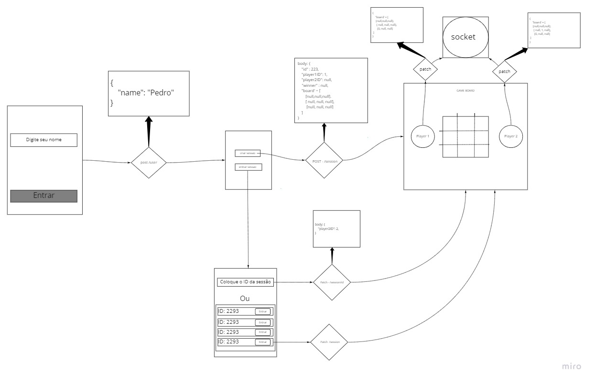

# Api-JogodaVelha
## Descrição do Projeto
Projeto de API de um jogo da velha que será implementado em Node+Express. Proposto para a disciplina IF977 - Engenharia de Software - Prof Vinícius Garcia.

## O Projeto


### - Método para o usuário criar uma nova sessão: 
- POST /session

Exemplo:

###### Pedido:
```
body223: {
  id: 223,
  player1ID: 123,
  player2ID: null,
  winner: null,
  board: [
  [null,null,null],
  [null, null, null],
  [null, null, null]
  ]
}
```
###### Resposta:
```
Created
body223: {
  id: 223,
  player1ID: 123,
  player2ID: null,
  winner: null,
  board: [
  [null,null,null],
  [null, null, null],
  [null, null, null]
  ]
}
```


### - Método para o usuário entrar em uma sessão com ID aleátoria, escolhida pelo sistema
- PATCH /session/player2ID

Exemplo:

###### Pedido:
```
{ 
player2ID: 4
}
```
###### Resposta: 
```
body224: {
  id: 224,
  player1ID: 3,
  player2ID: 4,
  winner: null,
  board: [
  [null,null,null],
  [null, null, null],
  [null, null, null]
  ]
}
```


### - Método para o usuário entrar em uma sessão com ID já existente, que o usuário colocará como input
- PATCH /session/player2ID

Exemplo:

###### Pedido:
```
{ 
player2ID: 2
}
```
###### Resposta: 
```
body223: {
  id: 223,
  player1ID: 1,
  player2ID: 2,
  winner: null,
  board: [
  [null,null,null],
  [null, null, null],
  [null, null, null]
  ]
}
```


### -  Método para o usuário mudar o "board" da sessão
- PATCH /session/board

Exemplo:

###### Pedido:
```
{ 
board: [
  [null,null,null],
  [null, 1, null],
  [null, null, null]
  ]
}
```
###### Resposta: 
```
body224: {
  id: 224,
  player1ID: 3,
  player2ID: 4,
  winner: null,
  board: [
  [null,null,null],
  [null, 1, null],
  [null, null, null]
  ]
}
```
### -  Método para ver se a sessão já está cheia
- GET/session/player2ID


### - Método para deletar sessão quando jogo terminar (winner for diferente de null)
- DELETE/session/id


## Wireframe simplificado




## Integrantes
- Alex Paulo Ferreira Damascena(apfd)
- Felipe De Carvalho Vasconcelos(fcv)
- Pedro da Matta Ribeiro Moura(pmrm)
- Sofia Melo Lucena(sml)
